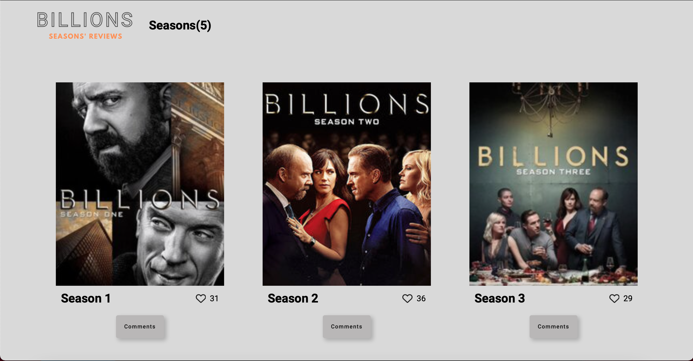
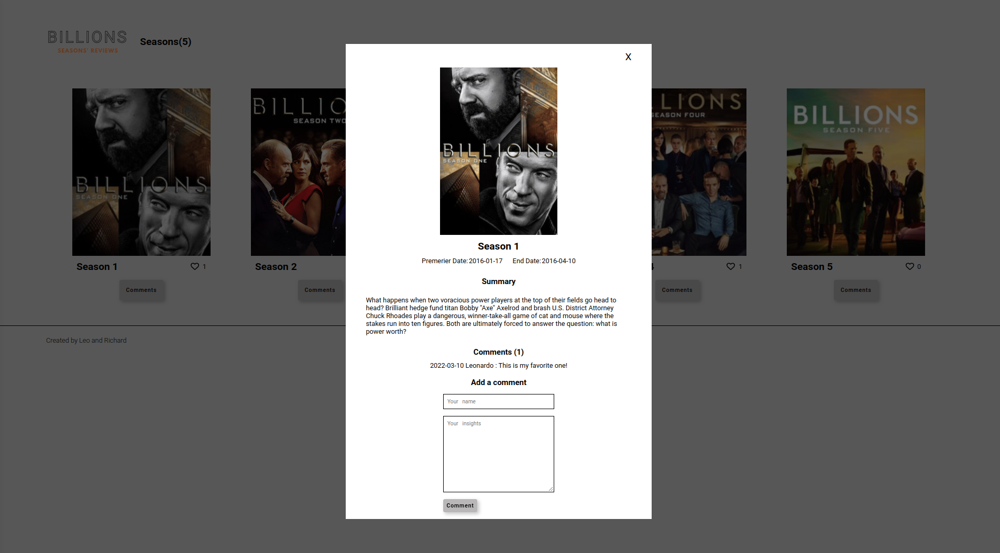

# Second Capstone : Billions Seasons Review

> This project is an implemention of a review application in which the user can like and comment on a given seeason of a series.

## Screenshot

## Built With
- Major Languages: JAVASCRIPT, HTML, CSS
- Major Technologies : Git, Github, Webpack

### Prerequisites
- npm ( Node Package Manager )
- git and Github Account

### Live Link
Live Link: https://leopiresgoss.github.io/second-capstone-project/dist/

### Setup
To get a local copy up and running follow these simple example steps.
- Open terminal
- Change the directory you want put the repo
- Then run
  
  i. git clone git@github.com:leopiresgoss/second-capstone-project.git
  
  ii. cd repo-name/

### Install linters
- **Webhint** linter

  `npm install --save-dev hint@6.x`

- **Stylelint** linter

  `npm install --save-dev stylelint@13.x stylelint-scss@3.x stylelint-config-standard@21.x stylelint-csstree-validator@1.x`

- **ESLint** linter

  `npm install --save-dev eslint@7.x eslint-config-airbnb-base@14.x eslint-plugin-import@2.x babel-eslint@10.x`

### Run linters
- **Webhint** 
linter -`npx hint .` on the root of your directory of your project.

- **Stylelint** 
linter - `npx stylelint "**/*.{css,scss}"` on the root of your directory of your project.

- **ESLint** linter
  - `npx eslint .` on the root of your directory of your project.

### Run project
- Now run the following:
 `npm install`  - on the root directory of the project to install the required packages
 `npm start`   - on the root directory of the project to start the project 

### API Used
The series data used in this project is from TV Maze API. For more info use this [link](https://www.tvmaze.com/api)

The comments and likes are stored at the Involvement API. For more information follow this [link](https://www.notion.so/Involvement-API-869e60b5ad104603aa6db59e08150270)

## Authors

👤 **Richard Opiyo**

- GitHub: [@richardoppiyo](https://github.com/richardoppiyo)
- Twitter: [@blessed_ricky](https://twitter.com/blessed_ricky)
- LinkedIn: [Richard Opiyo](https://linkedin.com/in/richardoppiyo)

👤 **Leonardo Pires Goss**

- GitHub: [@leopiresgoss](https://github.com/leopiresgoss)
- Twitter: [@leopiresgoss](https://twitter.com/leonardopgoss)
- [LinkedIn](https://www.linkedin.com/in/leonardogoss/)

## Show your support

Give a ⭐️ if you like this project!

## Acknowledgments

- To morning session team,reviewers and standup team members.

## 📝 License

This project is [MIT](./MIT.md) licensed.
